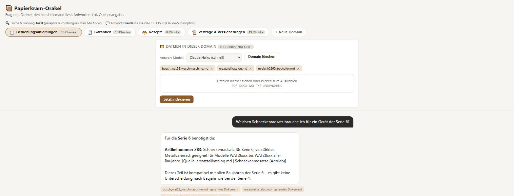

# 📦 Papierkram-Orakel


Ein lokales RAG-System (Retrieval Augmented Generation) für den Ordner voller
Dokumente, die sonst niemand liest: Geräte-Bedienungsanleitungen, Verträge,
Garantien, Rezepte. Frag in normaler Sprache, bekomme eine Antwort mit exakter
Quellenangabe (Datei + Seite/Abschnitt).

> "Welches Waschprogramm nutze ich für Wolle bei der Bosch WAT28?"
> → *Programm 4 (Wolle/Handwäsche), 20-30 Grad, max. 600 U/min*
> `[Quelle: bosch_wat28_waschmaschine.md | Waschprogramme]`



Das Projekt setzt das klassische RAG-Muster (retrieve → rerank → generate)
bewusst alltagstauglich und lokal um: eine Architektur, die sich per Ordner
um beliebige neue Themenbereiche ("Domains") erweitern lässt, ohne den
Kern-Code anzufassen.

Ausführlichere Dokumentation: [einfach erklärt](docs/ANLEITUNG_EINFACH.md) ·
[technisch](docs/ANLEITUNG_TECHNISCH.md).

## Architektur

Zwei Phasen:

```
Indexierung (einmalig pro Domain, "python cli.py ingest <domain>")
  raw/*.pdf|.md|.txt
    -> core/parsing.py     Text + Seiten-/Abschnittsnummer extrahieren
    -> core/chunking.py    absatzweise in ~700-Zeichen-Stücke schneiden
    -> core/embeddings.py  lokales Embedding-Modell -> Vektor
    -> core/store.py       SQLite: Vektor (sqlite-vec) + Volltext (FTS5)

Retrieval (bei jeder Frage, "python cli.py ask <domain> '...'")
  Frage
    -> passt die ganze Domain ins Kontextfenster
       (Gesamttext <= full_context_max_chars, Default 500k Zeichen)?
         ja  -> ganzes Dokument direkt ans LLM. Suche bringt hier nichts
                und schadet bei "wie viele ..."-Fragen sogar. Deckt fast
                jede private Dokumentensammlung ab.
         nein (sehr großer Bestand):
    -> core/embeddings.py  Frage -> Vektor
    -> core/store.py       Hybrid Search: Vektor-Suche + BM25 parallel,
                            Fusion per Reciprocal Rank Fusion (RRF)
    -> core/embeddings.py  Cross-Encoder Reranking der Kandidaten
    -> core/llm.py         claude CLI generiert Antwort inkl. Zitat
                           (Prompt über stdin, nicht als Argument)
```

| Pipeline-Schritt (typische Cloud-Lösung) | Lokale Entsprechung hier |
|---|---|
| OCR (z.B. Mistral OCR) | `core/parsing.py` (pymupdf + lokaler Tesseract-Fallback für Scans; Registry für weitere Dateitypen) |
| Chunking | `core/chunking.py` (~700 Zeichen, ~10% Overlap, absatzweise) |
| Embedding-Modell (z.B. Mistral Embed) | `core/embeddings.py` (lokales multilinguales Sentence-Transformer-Modell) |
| Vektordatenbank (z.B. Supabase/pgvector) | `core/store.py` (SQLite + sqlite-vec, eine Datei pro Domain) |
| Hybrid Search (semantisch + BM25) | `core/store.py: hybrid_search()` mit Reciprocal Rank Fusion |
| Reranking (z.B. Cohere) | `core/embeddings.py: rerank()` (lokaler Cross-Encoder) |
| LLM-Generierung (Cloud-API) | `core/llm.py` (ruft die `claude` CLI headless auf, nutzt die bestehende Claude-Code-Subscription) |

Warum SQLite statt Cloud-Vektor-DB? Aus einem einfachen Grund: kein
Vendor-Lock-in, eine einzelne Datei pro Domain, die du jederzeit
exportierst, löschst oder versionierst.

**Passt-alles-rein? Dann keine Suche.** Ist der Gesamttext einer Domain
kleiner als `full_context_max_chars` (Default 500 000 Zeichen ≈ 125k Token,
viel Reserve unter Claudes 200k; pro Domain einstellbar, `0` = immer
Hybrid-Suche), geht die **komplette** Domain ans LLM. Das trifft praktisch
jede private Dokumentensammlung — ein Lebenslauf, alle Geräte-Handbücher, ein
Ordner Bauunterlagen sind je ~20–90k Token. Retrieval wäre da nicht nur
überflüssig, sondern schädlich: bei Fragen wie *„wie viele Steckdosen pro
Etage"* muss über einen ganzen Abschnitt zusammengezählt werden, und eine
Auswahl von ein paar Chunks (zumal nach einem Reranker, der knappe
Stichpunktlisten schlecht bewertet) liefert dann Lücken. Die Hybrid-Pipeline
greift erst bei wirklich großen Beständen — genau dort, wo Retrieval
überhaupt nötig wird.

### Wo genau kommt ein LLM zum Einsatz?

Nur an einer einzigen Stelle. Suche und Ranking laufen komplett ohne LLM:

| Schritt | Modell-Typ | Ein LLM? |
|---|---|---|
| Embeddings (Text → Vektor) | `sentence-transformers` Bi-Encoder | ❌ Nein — spezialisiertes Modell, erzeugt nur Zahlen, keinen Text |
| Reranking (Chunks sortieren) | Cross-Encoder | ❌ Nein — gibt nur einen Relevanz-Score zurück |
| **Antwortgenerierung** (`core/llm.py`) | **Claude** (via `claude -p`) | ✅ **Ja, ausschließlich hier** |

Erst der letzte Schritt formuliert aus den gefundenen Zitat-Schnipseln einen
zusammenhängenden, natürlichsprachlichen Antworttext mit Quellenangabe —
und das ist auch der einzige Schritt, der über die Claude-Code-Subscription
läuft (alles davor ist lokal und modellunabhängig). Das Modell ist pro
Domain in `domain.yaml` über `llm_model` einstellbar (z.B. `haiku` als
schneller Default, `sonnet`/`opus` für komplexere Fragen).

## Quickstart

```bash
pip install -r requirements.txt

python cli.py list                 # verfügbare Domains anzeigen
python cli.py ingest --all         # alle Beispiel-Domains indexieren
python cli.py ask anleitungen "Welches Waschprogramm fuer Wolle?"

# oder als Web-Chat:
uvicorn webapp:app --reload --port 8010
# -> http://127.0.0.1:8010
```

> **Nur für den lokalen Betrieb gedacht.** Die Web-App hat keine
> Authentifizierung und die Upload-/Ingest-Endpunkte schreiben in den
> `domains/`-Ordner. Nicht ungeschützt ins Internet stellen.

Voraussetzung: [Claude Code](https://claude.com/claude-code) ist installiert
und eingeloggt (`claude` im PATH) — die Antwortgenerierung läuft über
`claude -p`, nutzt also deine bestehende Subscription statt eines separat
abgerechneten API-Keys. Alles andere (Embeddings, Reranking, Vektor- und
Volltextsuche) läuft komplett lokal und kostenlos.

Die ersten `ingest`/`ask`-Aufrufe laden zwei kleine Sentence-Transformer-
Modelle herunter (~500 MB, einmalig, danach lokal im HF-Cache).

Für den OCR-Fallback bei gescannten PDFs wird zusätzlich eine lokale
[Tesseract](https://github.com/tesseract-ocr/tesseract)-Installation
mit deutschem Sprachpaket (`deu`) vorausgesetzt. Ohne Tesseract funktioniert
alles andere weiterhin, gescannte Seiten liefern dann aber leeren Text.

## Tests

```bash
pip install -r requirements-dev.txt
python -m pytest
```

Die Unit-Tests decken Chunking, Hybrid-Store (RRF-Fusion, FTS-Query-Bau),
die Text-Parser und die Domain-Discovery ab. Sie laufen **ohne**
Embedding-Modelle und ohne die `claude`-CLI — genau das prüft auch die
[CI](.github/workflows/ci.yml) auf Python 3.11–3.13. Die vollständige
Pipeline (inkl. OCR und Antwortgenerierung) prüft `python eval.py`.

## Qualität: was der Eval-Lauf zeigt

`python eval.py` prüft 20 handgeschriebene Testfragen gegen bekannte
erwartete Quellen/Stichworte (Retrieval-Trefferquote + Antwort-Korrektheit),
statt nur ein paar Fragen von Hand durchzuklicken. Enthalten sind bewusst
harte Fälle:

- **Fast identische Ersatzteile mit unterschiedlicher Artikelnummer**
  (`ersatzteilkatalog.md`) — der "Schneckenradsatz"-Fall, bei dem die
  *exakte* Artikelnummer zählt, nicht die bedeutungsähnlichste.
- **Ein synthetisch gescanntes PDF ohne Textebene** (`kaufbeleg_thinkpad_scan.pdf`),
  das nur über den Tesseract-OCR-Fallback lesbar wird.

Aktueller Stand (lokale Modelle, 4 Domains, ~49 Chunks): **20/20 Retrieval-
Treffer, 20/20 korrekte Antworten**. Das ist ein echtes Signal, aber kein
unabhängiger Benchmark — Fragen und Dokumente stammen von mir, das Testset
ist klein, und weil alle vier Beispiel-Domains klein genug sind, laufen sie
im Ganzes-Dokument-Modus (die Hybrid-Suche + Reranking + der
Stoppwort-gefilterte FTS-Query-Bau werden deterministisch in
`tests/test_rag.py` und `tests/test_store.py` geprüft). Bei Beständen jenseits
des Kontextfensters (die Größenordnung, bei der Retrieval erst richtig
relevant wird) ist weiterhin unklar, wie belastbar das bleibt.

## Eine neue Domain hinzufügen

**Ohne Terminal, direkt im Browser** (`uvicorn webapp:app --reload --port 8010` →
http://127.0.0.1:8010): oben auf **"+ Neue Domain"** klicken, Name/Emoji/
Beschreibung/Persona eintragen → Dateien per Drag&Drop in den Datei-Bereich
ziehen (`.pdf`, `.docx`, `.md`, `.txt`, `.jpg`/`.jpeg`/`.png`/`.heic` —
Fotos und Scans laufen automatisch durch den Tesseract-OCR-Fallback) →
**"Jetzt indexieren"** klicken → direkt loschatten.

In der Web-UI lassen sich außerdem einzelne Dateien wieder aus einer Domain
entfernen (`×` am Datei-Chip, danach neu indexieren), ganze Domains löschen
und das Antwort-Modell (Claude Haiku/Sonnet/Opus) pro Domain umstellen. Die
Kopfzeile zeigt, was lokal läuft (Suche + Reranking) und was über die
`claude`-CLI geht (die Antwort). Unter jeder Antwort steht, welches Modell
sie erzeugt hat, ob per Ganzes-Dokument- oder Hybrid-Such-Pfad, **wie groß
der Dokument-Kontext war** (Token-Schätzung — so siehst du bei großen
Domains, was eine Frage kostet) und ob der Prompt-Cache griff. Der Cache der
`claude`-CLI (1 h) macht Folgefragen an dieselbe Domain rund 10× günstiger.

**Oder klassisch über die Kommandozeile** (3 Schritte, kein Code nötig):

1. `domains/<slug>/raw/` anlegen und eigene Dateien reinlegen
2. `domains/<slug>/domain.yaml` schreiben (Anzeigename, Emoji, Persona-Prompt,
   siehe bestehende Domains als Vorlage)
3. `python cli.py ingest <slug>` ausführen

Beide Wege führen zum selben Ergebnis: Die Domain taucht danach in
`cli.py list`, `cli.py ask` und im Domain-Selector der Web-UI auf.

Ideen für eigene Domains: Steuerunterlagen, Auto-Handbuch + Wartungsheft,
Möbel-Aufbauanleitungen (Ikea & Co.), Vereinssatzungen, Kochbücher nach
Region, Arbeitsvertrag + Betriebsvereinbarungen.

## Erweiterungspunkte

- **Andere Embeddings/Reranker**: `EMBEDDING_MODEL_NAME` /
  `RERANKER_MODEL_NAME` in `core/embeddings.py` austauschen (z.B. gegen
  Ollama- oder API-Modelle) — `store.py`/`rag.py` bekommen davon nichts mit,
  sie sehen nur Vektoren und Scores.
- **Andere Dateiformate/OCR**: neuen Parser in `core/parsing.py`s
  `PARSERS`-Dict registrieren. Bereits unterstützt: PDF (digital + Scan),
  DOCX (inkl. Tabellen), Markdown, TXT, sowie JPG/PNG/HEIC-Fotos direkt per
  OCR (der "Handyfoto vom Vertrag"-Fall). Für exotischere Formate (z.B.
  `.doc`, E-Mails, Excel) einfach eine weitere Funktion ergänzen.
- **Anderes LLM-Backend**: `core/llm.py: generate_answer()` ersetzen, z.B.
  durch einen direkten Anthropic-/OpenAI-/Ollama-API-Call.
- **Knowledge Graph / GraphRAG**: aktuell bewusst weggelassen (einfache
  Lösung zuerst) — ließe sich als zusätzlicher Store neben `store.py`
  ergänzen, wenn Fragen viele Entitäts-Hops brauchen.

## Projektstruktur

```
core/
  config.py      Domain-Konfiguration laden + Domains entdecken
  parsing.py     PDF/MD/TXT -> (Ort, Text)-Abschnitte
  chunking.py    Abschnitte -> überlappende Chunks
  embeddings.py  lokale Embeddings + Reranking
  store.py       SQLite Hybrid-Store (Vektor + FTS5 + RRF)
  llm.py         Antwortgenerierung über die claude CLI
  rag.py         Orchestrierung: ingest_domain() / answer_question()
domains/<slug>/
  domain.yaml    Anzeigename, Emoji, Persona, Chunking-/Retrieval-Parameter
  raw/           eigene Quelldateien
cli.py           list / ingest / ask
eval.py          Qualitäts-Testset: Retrieval- und Antwort-Trefferquote
webapp.py        FastAPI: /api/domains, /api/chat
static/index.html Chat-UI
tests/           Offline-Unit-Tests (pytest)
data/            generierte SQLite-Dateien (nicht versioniert)
```

## Lizenz

[MIT](LICENSE) © Sascha Schumbera

Die Beispieldokumente unter `domains/*/raw/` sind frei erfunden und dienen
nur zur Demonstration.
